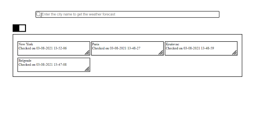
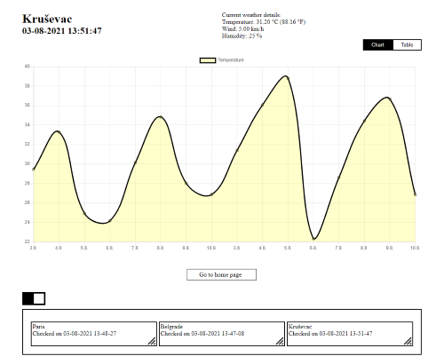
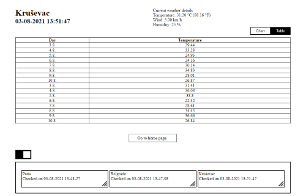
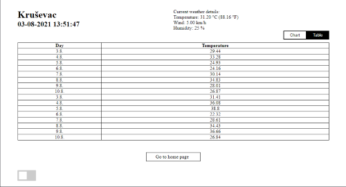

# Weather Forecast

*Weather forecast app made in Angular.*


## Application Desing

### *Home Page*


Home page when the user enters the app. User can search for the city, or click on one of the previous searches.

### *City Page With Chart*


Information about the weather in the selected city, including a seven week forecast. User can navigate back home, or select one of the previous cities.

### *City Page With Table*


Information about the weather in the selected city, including a seven week forecast. User can navigate back home, or select one of the previous cities.

### *City Page*


City page but with closed suggestions box for further searches.


## Other remarks

### How to start and build the project

- run ```npm install``` to install the necessary dependencies
- run ```npm run serve``` to start the app